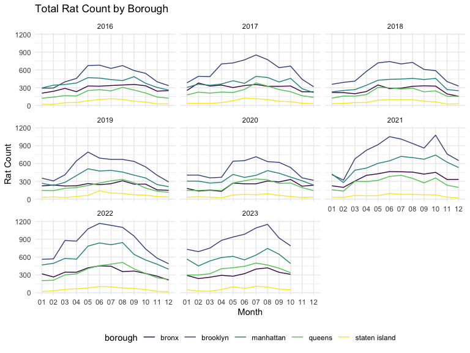

p8105_fp_nl2835
================
Nancy Le
2023-12-02

Looking into rat sighting v waste data

``` r
waste <-
  read.csv("DSNY_Monthly_Tonnage_Data_20231202.csv") |> 
  janitor::clean_names() |> 
  separate(month, into = c("year", "month"), sep = " / ") |> 
  group_by(year, month, borough) |>
  filter(year >= 2016 & year < 2024 ) |>
  summarize(
    total_refuse = sum(refusetonscollected, na.rm = TRUE),
    total_paper = sum(papertonscollected, na.rm = TRUE),
    total_mgp = sum(mgptonscollected, na.rm = TRUE)) |> 
  mutate_all(tolower) |> 
  mutate(across(where(is.character), trimws)) 
```

``` r
sightings <-
  read_csv('NYC_Rat_Sightings.csv') |> 
  janitor::clean_names() |> 
  separate(created_date, into=c("month","e", "day","f", "year", "g", "time"), sep=c(2,3,5,6,10,11)) |> 
  select(-e,-f,-g) |> 
  mutate(date = paste(year, month, day, sep=""), 
         date = as.numeric(date)) |>  
  filter(date <= 20231031, date >= 20160101, !incident_zip <= 10000, !incident_zip >11697, !borough %in% c("Unspecified", NA)) |> 
  select(
    -agency, -agency_name, -complaint_type, -descriptor, -landmark, -facility_type, -park_facility_name, -vehicle_type, -taxi_company_borough, -taxi_pick_up_location, -bridge_highway_name, -road_ramp, -bridge_highway_segment, -bridge_highway_direction) |>
  select(unique_key, date, year, month, day, everything()) |> 
  mutate_all(tolower) |>
  mutate(across(where(is.character), trimws)) |> 
  group_by(year, month, borough) |> 
  summarize(ratcount = n()) 
```

``` r
merged = inner_join(waste, sightings, 
            by = c("year", "month", "borough")) 
```

visualization

``` r

merged$year_month <- factor(paste(merged$year, merged$month, sep = "-"))

ggplot(merged, aes(x=month, y = ratcount, color = borough, group = interaction(year, borough))) + 
    geom_line() + 
    labs(title = "Total Rat Count by Borough",
         x = "Month",
         y = "Rat Count") +
  facet_wrap(year ~ . )
```


